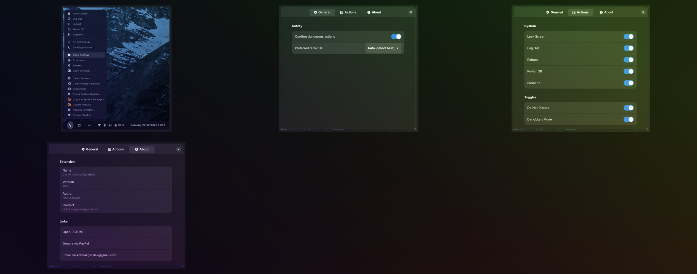
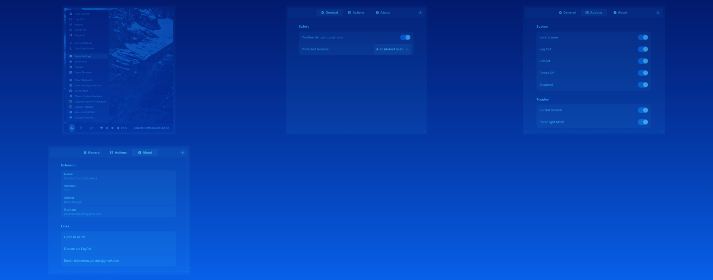
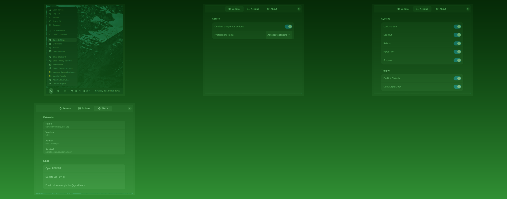
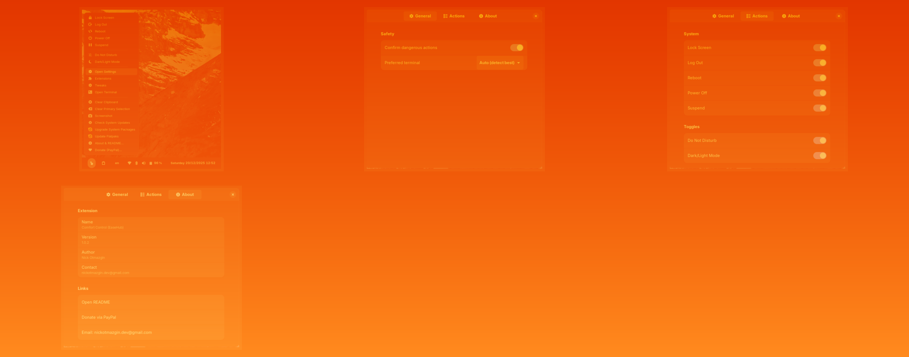

# Comfort Control (EaseHub)

[](https://github.com/nickotmazgin/comfort-control-easehub/releases)
[](https://github.com/nickotmazgin/comfort-control-easehub/releases)


A **GNOME Shell extension** that brings **comfort and control to your desktop** — providing quick access to power actions, seamless screenshot helpers, and intelligent system update prompts.

---

## ✨ Features

### 🔋 **Power Control Hub**
* **Unified menu** with quick access to essential power actions:
  - 🔒 **Lock** - Secure your session instantly
  - 👋 **Logout** - Sign out safely
  - 💤 **Suspend** - Save power while keeping session
  - 🔄 **Reboot** - Restart your system
  - ⚡ **Power Off** - Shut down completely

### 📸 **Smart Screenshots**
* **Intelligent screenshot handling**:
  - Uses **GNOME's native Wayland** screenshot UI when available
  - **Automatic fallback** to `gnome-screenshot` on Xorg or legacy setups
  - **Seamless experience** across different display protocols

### 🛠️ **System Update Helpers**
* **Smart package management**:
  - **Cross-distro support**: APT, DNF, Zypper, Pacman, Flatpak
  - **Exact install commands** shown for missing tools
  - **Terminal integration** - updates run in your terminal for full visibility
  - **Secure authentication** using `pkexec` for graphical password prompts

### 🧩 **Configurable Actions & Terminal**
* Enable/disable any menu item from Preferences → Actions
* Set a preferred terminal (kgx, gnome-terminal, tilix, etc.) in Preferences

### 🎯 **Compatibility**
* **Officially supports** GNOME Shell versions **42–47**
* **Cross-platform** - Works on Wayland and Xorg
* **Lightweight** - Minimal resource usage

---

## 📦 Installation

### 📁 **From GitHub Release**

1. **Download** the latest `gnome-shell-easehub-v*.zip` from our [**Releases Page**](https://github.com/nickotmazgin/comfort-control-easehub/releases)

2. **Install** via GNOME Extensions app or terminal:
   ```bash
   gnome-extensions install --force gnome-shell-easehub-v*.zip
   gnome-extensions enable comfort-control@nickotmazgin
   ```

3. **Restart** GNOME Shell:
   - **Wayland**: Log out and back in
   - **Xorg**: Press **Alt+F2**, type `r`, and press Enter

### 🔧 **From Source (Developers)**

```bash
# Set extension UUID
uuid="comfort-control@nickotmazgin"

# Clone and install
git clone https://github.com/nickotmazgin/comfort-control-easehub.git \
  ~/.local/share/gnome-shell/extensions/"$uuid"

# Compile schemas
glib-compile-schemas ~/.local/share/gnome-shell/extensions/"$uuid"/schemas

# Enable extension
gnome-extensions enable "$uuid"
```

**Note**: On Wayland, you may need to log out/in for changes to take effect.

### 📥 Which Zip Should I Download?

Every release publishes two artifacts; choose based on your GNOME Shell version:
- GNOME 42–44 → download the file named `comfort-control@nickotmazgin-42-44.shell-extension.zip`
- GNOME 45–47 → download the file named `comfort-control@nickotmazgin-45-47.shell-extension.zip`

Both zips include compiled schemas to ensure Preferences open correctly.
Find them on the Releases page: https://github.com/nickotmazgin/comfort-control-easehub/releases

### 🧪 Packaging (CI)

On tag push (`v*`), GitHub Actions builds `comfort-control@nickotmazgin.shell-extension.zip` and publishes a release automatically.

---

## 🖼️ **Screenshots & Visuals**

Explore more screenshots and visual examples in our [**screenshots/**](screenshots/) directory.

### Tri‑color Collage

Single collage with a subtle blue → green → orange gradient overlay for visual harmony and readability:



### Collages

Below are curated collages built from the latest screenshots. Choose a theme you like:








---

## 🤝 **Contributing**

We welcome contributions! Please feel free to:
- 🐛 **Report bugs** via [GitHub Issues](https://github.com/nickotmazgin/comfort-control-easehub/issues)
- 💡 **Suggest features** or improvements
- 🔧 **Submit pull requests** with enhancements
- 🌐 **Help with translations**

See CHANGELOG.md for notable changes.

---

## 📄 **License**

This project is licensed under the [**MIT License**](LICENSE) © **Nick Otmazgin**

---

## ☕ **Support the Project**

If **EaseHub** enhances your GNOME experience, consider supporting its continued development:

[](https://github.com/sponsors/nickotmazgin)
[](https://www.paypal.com/donate/?hosted_button_id=4HM44VH47LSMW)

Your support helps maintain and improve this extension for the entire GNOME community! 💙

---

## 👤 **About**

- Author: **Nick Otmazgin**
- Contact: **nickotmazgin.dev@gmail.com**

---

*Made with ❤️ for the GNOME community*
