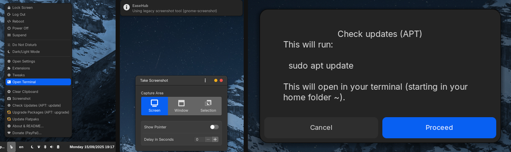

# Comfort Control (EaseHub)

[](https://extensions.gnome.org/extension/8599/comfort-control-easehub/)



A GNOME Shell extension that brings **comfort and control to your desktop** — quick access to system actions, screenshot helpers, and update prompts.

---

## ✨ Features

* **Unified Menu**: Quick access to power actions: Lock, Logout, Suspend, Reboot, Power Off.
* **Screenshots Made Easy**:
    * Uses GNOME's native Wayland screenshot UI when available.
    * Falls back to `gnome-screenshot` on Xorg or legacy setups.
* **Secure Update Helpers**:
    * Uses `pkexec` for a secure, graphical password prompt for `apt` commands.
    * Update actions run in a terminal, giving you full control and visibility.

---

## 📦 Installation

### From extensions.gnome.org (EGO)

The recommended method is to install from the official GNOME Shell Extensions website:
**[https://extensions.gnome.org/extension/8599/comfort-control-easehub/](https://extensions.gnome.org/extension/8599/comfort-control-easehub/)**

### From GitHub Release

1. Download the latest `gnome-shell-easehub-v*.zip` from the [Releases Page](https://github.com/nickotmazgin/comfort-control-easehub/releases).
2. Install it with the GNOME Extensions app or from your terminal:
   ```bash
   gnome-extensions install gnome-shell-easehub-v*.zip
   ```
3. Enable the extension, either through the app or with:
   ```bash
   gnome-extensions enable comfort-control@nickotmazgin
   ```

### From Source

```bash
uuid="comfort-control@nickotmazgin"
git clone https://github.com/nickotmazgin/comfort-control-easehub.git \
  ~/.local/share/gnome-shell/extensions/"$uuid"
glib-compile-schemas ~/.local/share/gnome-shell/extensions/"$uuid"/schemas
gnome-extensions enable "$uuid"
```

On Wayland, you may need to log out and back in for the extension to appear. On Xorg, you can press **Alt+F2**, type `r`, and press Enter.

---

## 🖼 Screenshots

See the [screenshots/](screenshots/) folder for more visuals.

---

## 📝 License

[MIT License](LICENSE) © Nick Otmazgin

---

## ☕ Support & Donations

If you find EaseHub useful, consider supporting development 💙

* **PayPal** → [paypal.me/NickOtmazgin](https://paypal.me/NickOtmazgin)
