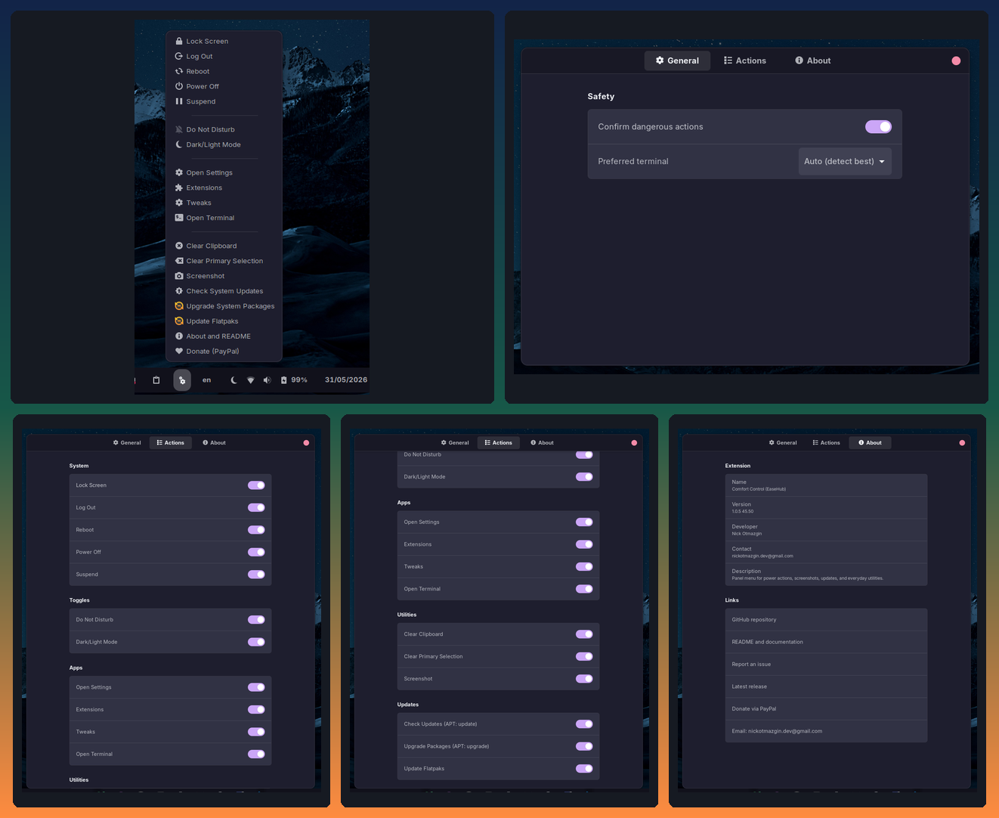

# Comfort Control (EaseHub)

[](https://github.com/nickotmazgin/comfort-control-easehub/releases/latest)
[](https://github.com/nickotmazgin/comfort-control-easehub/releases)
[](LICENSE)
[](#compatibility)
[](#compatibility)
[](#compatibility)

[](https://github.com/nickotmazgin/comfort-control-easehub/issues)
[](https://github.com/nickotmazgin/comfort-control-easehub/discussions)
[](https://github.com/sponsors/nickotmazgin)
[](https://www.paypal.com/donate/?hosted_button_id=4HM44VH47LSMW)

A **GNOME Shell extension** that brings **comfort and control to your desktop** — quick access to power actions, Wayland screenshots, system updates, and everyday utilities from one panel menu.

> **Keywords:** GNOME panel menu · power management · screenshots · dark mode · DND · terminal · Flatpak · APT · Linux utilities · open source

**Latest:** v1.0.5 — GNOME 45–50 ESM

> **GNOME Shell 42–44 is no longer supported.** EaseHub requires **GNOME 45–50**.

---

## Compatibility

| GNOME | Status | Notes |
| ----- | ------ | ----- |
| **45–50** | **Supported** | ESM build; zip `comfort-control@nickotmazgin-45-50` |
| **42–44** | **Discontinued** | No longer built or maintained |

**Minimum requirement:** GNOME Shell **45**.

---

## ✨ Features

### 🔋 **Power Control Hub**
* **Unified menu** with quick access to essential power actions:
  - 🔒 **Lock** - Secure your session instantly
  - 👋 **Logout** - Sign out safely
  - 💤 **Suspend** - Save power while keeping session
  - 🔄 **Reboot** - Restart your system
  - ⚡ **Power Off** - Shut down completely

### 📸 **Smart Screenshots**
* **Intelligent screenshot handling**:
  - Uses **GNOME's native Wayland** screenshot UI when available
  - **Automatic fallback** to `gnome-screenshot` on Xorg or legacy setups
  - **Seamless experience** across different display protocols

### 🛠️ **System Update Helpers**
* **Smart package management**:
  - **Cross-distro support**: APT, DNF, Zypper, Pacman, Flatpak
  - **Exact install commands** shown for missing tools
  - **Terminal integration** - updates run in your terminal for full visibility
  - **Secure authentication** using `pkexec` for graphical password prompts

### 🧩 **Configurable Actions & Terminal**
* Enable/disable any menu item from Preferences → Actions
* Set a preferred terminal (kgx, gnome-terminal, tilix, etc.) in Preferences
* **Restart GNOME Shell…** — safe step-by-step guide (Alt+F2 → r); does not auto-restart (avoids session logout on Zorin)
* **Sudo Timeout** submenu — status via **sudo-show**, **sudo -v**, interactive menu, and 15/30/60/120 min presets (terminal stays open)

---

## 📦 Installation

### 📁 **From GitHub Release**

1. **Download** the latest release ZIP from the [**Releases Page**](https://github.com/nickotmazgin/comfort-control-easehub/releases/latest)

2. **Install** via GNOME Extensions app or terminal:
   ```bash
   gnome-extensions install --force comfort-control@nickotmazgin-45-50.shell-extension.zip
   gnome-extensions enable comfort-control@nickotmazgin
   ```

3. **Restart** GNOME Shell:
   - **Wayland**: Log out and back in
   - **Xorg**: Press **Alt+F2**, type `r`, and press Enter

### 🔧 **From Source (Developers)**

```bash
# Set extension UUID
uuid="comfort-control@nickotmazgin"

# Clone and install
git clone https://github.com/nickotmazgin/comfort-control-easehub.git \
  ~/.local/share/gnome-shell/extensions/"$uuid"

# Compile schemas
glib-compile-schemas ~/.local/share/gnome-shell/extensions/"$uuid"/schemas

# Enable extension
gnome-extensions enable "$uuid"
```

**Note**: On Wayland, you may need to log out/in for changes to take effect.

### 📥 Which Zip Should I Download?

Download **`comfort-control@nickotmazgin-45-50.shell-extension.zip`** from the [Releases page](https://github.com/nickotmazgin/comfort-control-easehub/releases/latest) (GNOME Shell **45–50** only).

### 🧪 Packaging (CI)

On tag push (`v*`), GitHub Actions runs `create-release-zips.sh` and publishes:

- `comfort-control@nickotmazgin-45-50.shell-extension.zip`

---

## 🖼️ **Screenshots**



Share-ready preview: [social-preview-2026.png](screenshots/social-preview-2026.png)

We welcome contributions! Please feel free to:
- 🐛 **Report bugs** via [GitHub Issues](https://github.com/nickotmazgin/comfort-control-easehub/issues)
- 💡 **Suggest features** or improvements
- 🔧 **Submit pull requests** with enhancements
- 🌐 **Help with translations**

See CHANGELOG.md for notable changes.

---

## 📄 **License**

This project is licensed under the [**MIT License**](LICENSE) © **Nick Otmazgin**

---

## ☕ **Support the Project**

If **EaseHub** enhances your GNOME experience, consider supporting its continued development:

[](https://github.com/sponsors/nickotmazgin)
[](https://www.paypal.com/donate/?hosted_button_id=4HM44VH47LSMW)

Your support helps maintain and improve this extension for the entire GNOME community! 💙

---

## 👤 **About**

- Author: **Nick Otmazgin**
- Contact: **nickotmazgin.dev@gmail.com**

---

## Find this project

**GitHub topics:** `gnome-shell-extension` · `panel-menu` · `power-management` · `screenshot` · `flatpak` · `wayland` · `linux` · `productivity` · `open-source`

**Search for:** GNOME panel menu extension, Linux power menu, EaseHub GNOME, system utilities tray, screenshot extension GNOME

## More GNOME extensions by Nick Otmazgin

- [ClipFlow Pro](https://github.com/nickotmazgin/clipflow-pro) — clipboard history manager with pins, stars & privacy
- [Numeric Clock](https://github.com/nickotmazgin/Linux-Numeric-Date-And-Clock) — DD/MM/YYYY 24-hour top-bar clock with seconds

---

*Made with ❤️ for the GNOME community*
