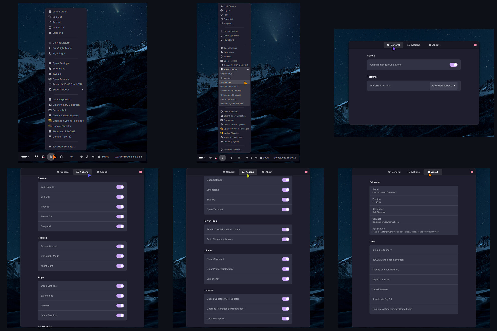
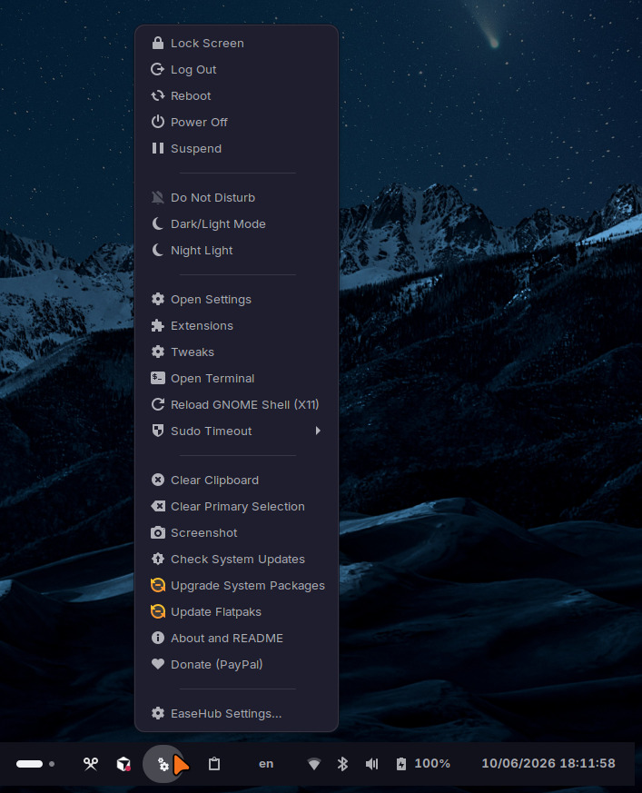
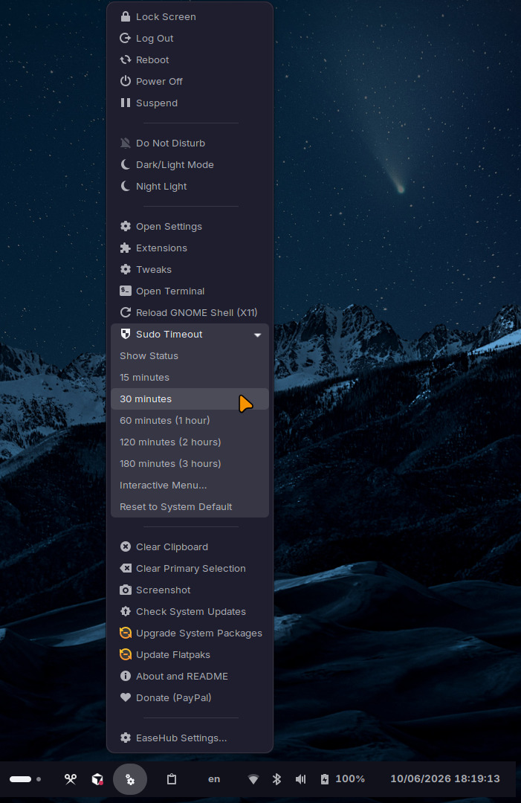
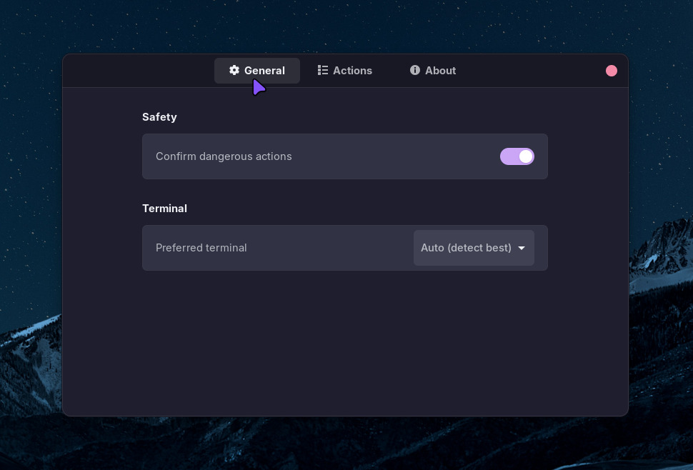
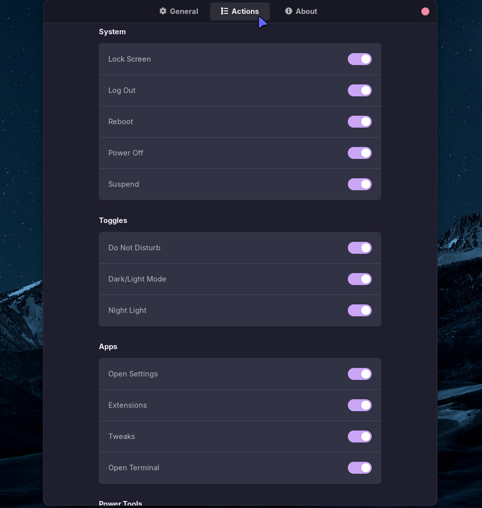
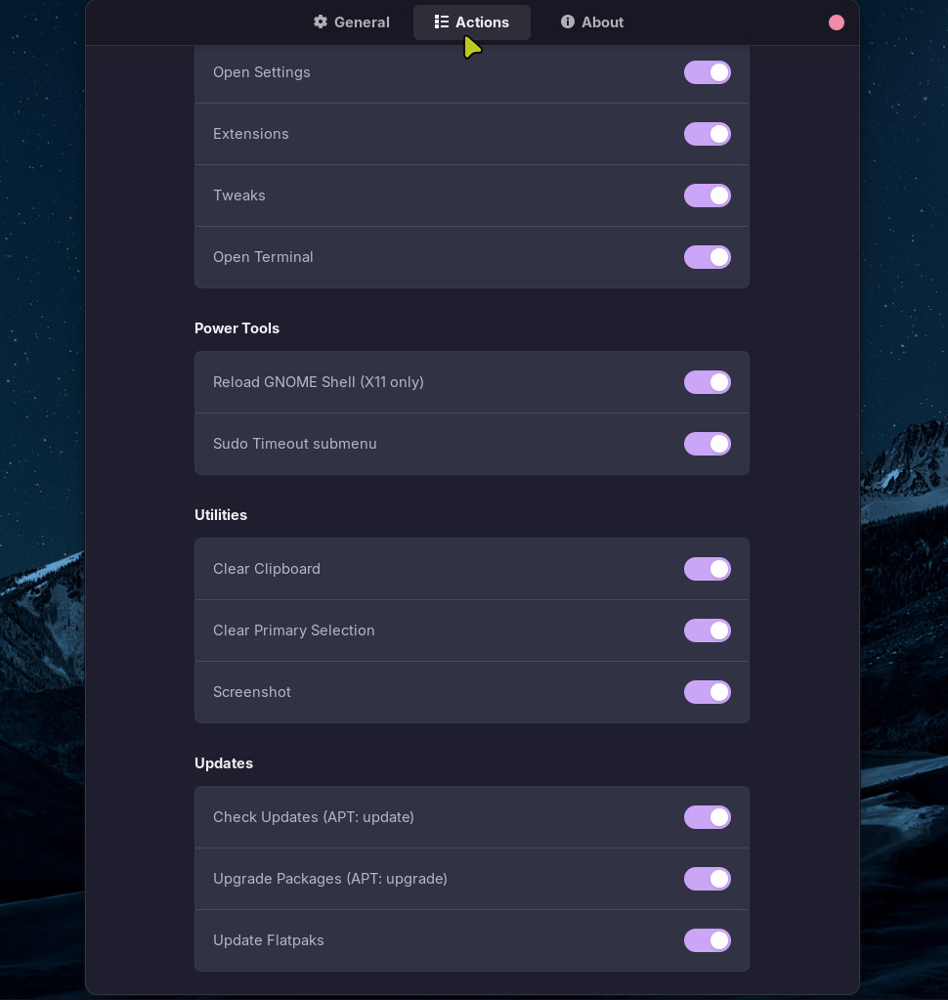
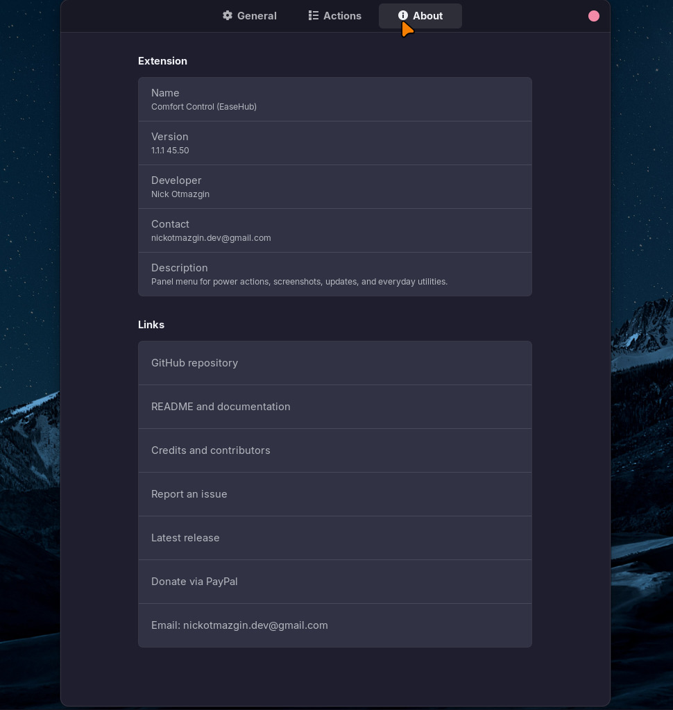

# Comfort Control (EaseHub)

[](https://github.com/nickotmazgin/comfort-control-easehub/releases/latest)
[](https://github.com/nickotmazgin/comfort-control-easehub/actions)
[](https://github.com/nickotmazgin/comfort-control-easehub/releases)
[](LICENSE)
[](#compatibility)
[](#compatibility)
[](#compatibility)

[](https://github.com/nickotmazgin/comfort-control-easehub/issues)
[](https://github.com/nickotmazgin/comfort-control-easehub/discussions)
[](https://www.paypal.com/donate/?hosted_button_id=4HM44VH47LSMW)

A **GNOME Shell extension** that brings **comfort and control to your desktop** — quick access to power actions, Wayland screenshots, system updates, and everyday utilities from one panel menu.

> **Keywords:** GNOME panel menu · power management · screenshots · dark mode · DND · terminal · Flatpak · APT · Linux utilities · open source

**Latest:** v1.1.2 — GNOME 45–50 ESM (fixes Lock/Log Out/Reboot/Power Off/Suspend via GNOME SystemActions; plus v1.1.1 features below)

> **Upgrade from v1.1.1:** Install [v1.1.2](https://github.com/nickotmazgin/comfort-control-easehub/releases/latest) if power/session menu items failed on GNOME 46+. Older releases (including v1.1.1) remain available for history and rollback — we do not delete prior tags.

> **GNOME Shell 42–44 is no longer supported.** EaseHub requires **GNOME 45–50**.

---

## Compatibility

| GNOME | Status | Notes |
| ----- | ------ | ----- |
| **45–50** | **Supported** | ESM build; zip `comfort-control@nickotmazgin-45-50` |
| **42–44** | **Discontinued** | No longer built or maintained |

**Minimum requirement:** GNOME Shell **45**.

---

## ✨ Features

### 🔋 **Power Control Hub**
* **Unified menu** with quick access to essential power actions (via GNOME Shell **SystemActions**, same path as the official power menu):
  - 🔒 **Lock** - Secure your session instantly
  - 👋 **Logout** - Sign out safely
  - 💤 **Suspend** - Save power while keeping session
  - 🔄 **Reboot** - Restart your system
  - ⚡ **Power Off** - Shut down completely

### 📸 **Smart Screenshots**
* **Intelligent screenshot handling**:
  - Uses **GNOME's native Wayland** screenshot UI when available
  - **Automatic fallback** to `gnome-screenshot` on Xorg or legacy setups
  - **Seamless experience** across different display protocols

### 🛠️ **System Update Helpers**
* **Smart package management**:
  - **Cross-distro support**: APT, DNF, Zypper, Pacman, Flatpak
  - **Exact install commands** shown for missing tools
  - **Terminal integration** - updates run in your terminal for full visibility
  - **Secure authentication** using `pkexec` for graphical password prompts

### 🔄 **Reload GNOME Shell (X11 only)** — new in v1.1.0
* One click triggers GNOME's own **Alt+F2 → r** restart path (via `xdotool`) — the extension never calls `Meta.restart()` itself, so it can't crash your session
* Verifies the restart from the **Shell journal and a live D-Bus ping**, then confirms with a notification
* Automatically hidden on Wayland (an in-place shell restart is impossible there)
* Requires `xdotool` (`sudo apt install xdotool` or your distro's equivalent)

### 🔐 **Sudo Timeout** — new in v1.1.0
* Control how long `sudo` remembers your password right from the panel: status, **15/30/60/120/180 minutes**, an interactive terminal menu, and reset to system default
* Safe by design: every change is **`visudo`-validated** before install, written to one drop-in file (`/etc/sudoers.d/99-easehub-sudo-timeout-<user>`), backed up, and **rolled back automatically** if validation fails
* Clear SUCCESS/ERROR terminal output plus desktop notifications

### 🧩 **Configurable Actions & Terminal**
* Enable/disable any menu item from Preferences → Actions (menu updates live)
* Set a preferred terminal (kgx, gnome-terminal, tilix, etc.) in Preferences
* **EaseHub Settings…** always available at the bottom of the panel menu
* Quick toggles: Do Not Disturb, Dark/Light Mode, and **Night Light**

---

## 📦 Installation

### 📁 **From GitHub Release**

1. **Download** the latest release ZIP from the [**Releases Page**](https://github.com/nickotmazgin/comfort-control-easehub/releases/latest)

2. **Install** via GNOME Extensions app or terminal:
   ```bash
   gnome-extensions install --force comfort-control@nickotmazgin-45-50.shell-extension.zip
   gnome-extensions enable comfort-control@nickotmazgin
   ```

3. **Restart** GNOME Shell:
   - **Wayland**: Log out and back in
   - **Xorg**: Press **Alt+F2**, type `r`, and press Enter

### 🔧 **From Source (Developers)**

```bash
# Set extension UUID
uuid="comfort-control@nickotmazgin"

# Clone and install
git clone https://github.com/nickotmazgin/comfort-control-easehub.git \
  ~/.local/share/gnome-shell/extensions/"$uuid"

# Compile schemas
glib-compile-schemas ~/.local/share/gnome-shell/extensions/"$uuid"/schemas

# Enable extension
gnome-extensions enable "$uuid"
```

**Note**: On Wayland, you may need to log out/in for changes to take effect.

### 📥 Which Zip Should I Download?

Download **`comfort-control@nickotmazgin-45-50.shell-extension.zip`** from the [Releases page](https://github.com/nickotmazgin/comfort-control-easehub/releases/latest) (GNOME Shell **45–50** only). That is **v1.1.2** today.

| Release | Status |
| ------- | ------ |
| **v1.1.2** | **Recommended** — current; fixes power/session actions |
| v1.1.1 | Superseded for power/session; kept for history / rollback |
| v1.1.0 and older | Archived; see [CHANGELOG](CHANGELOG.md) |

### 🧪 Packaging (CI)

On tag push (`v*`), GitHub Actions runs `create-release-zips.sh` and publishes:

- `comfort-control@nickotmazgin-45-50.shell-extension.zip`

---

## 🖼️ **Screenshots**

*EaseHub v1.1.1 — click any image to view it full size.*

[](screenshots/collage.jpg)

<table>
  <tr>
    <td align="center">
      <a href="screenshots/m1.jpg"></a><br>
      <b>m1</b> — Panel menu (all actions)
    </td>
    <td align="center">
      <a href="screenshots/m2.jpg"></a><br>
      <b>m2</b> — Sudo Timeout submenu
    </td>
    <td align="center">
      <a href="screenshots/m3.jpg"></a><br>
      <b>m3</b> — Preferences · General
    </td>
  </tr>
  <tr>
    <td align="center">
      <a href="screenshots/m4.jpg"></a><br>
      <b>m4</b> — Actions · System &amp; Toggles
    </td>
    <td align="center">
      <a href="screenshots/m5.jpg"></a><br>
      <b>m5</b> — Actions · Power Tools &amp; Updates
    </td>
    <td align="center">
      <a href="screenshots/m6.jpg"></a><br>
      <b>m6</b> — Preferences · About
    </td>
  </tr>
</table>

We welcome contributions! Please feel free to:
- 🐛 **Report bugs** via [GitHub Issues](https://github.com/nickotmazgin/comfort-control-easehub/issues)
- 💡 **Suggest features** or improvements
- 🔧 **Submit pull requests** with enhancements
- 🌐 **Help with translations**

See CHANGELOG.md for notable changes.

---

## 📄 **License**

This project is licensed under the [**MIT License**](LICENSE) © **Nick Otmazgin**

---

## ☕ **Support the Project**

If **EaseHub** enhances your GNOME experience, consider supporting its continued development:

[](https://www.paypal.com/donate/?hosted_button_id=4HM44VH47LSMW)

Your support helps maintain and improve this extension for the entire GNOME community! 💙

---

## 👤 **About**

- Author: **Nick Otmazgin**
- Contact: **nickotmazgin.dev@gmail.com**

---

## Credits & Acknowledgements

Comfort Control (EaseHub) is created, maintained, signed, and released by **[Nick Otmazgin](https://github.com/nickotmazgin)** — the project's sole administrator and solo developer, who authors and reviews all code that ships.

[](https://openai.com/codex/)
[](https://cursor.com)

Recent releases were built with help from AI pair-programming agents, operated under the maintainer's direction and review:

- **OpenAI Codex** — release engineering, signed-tag release workflows, packaging and validation hardening
- **Cursor (Agent)** — code review, debugging, CI workflow hardening, documentation

Every AI-assisted change is human-reviewed, tested on real GNOME sessions, and approved by the maintainer before release. See [CONTRIBUTORS.md](CONTRIBUTORS.md) for the full credits.

> OpenAI and Codex are trademarks of OpenAI. Cursor is a trademark of Anysphere, Inc. These names are used here solely for factual attribution. EaseHub is an independent project and is **not** affiliated with, sponsored, or endorsed by OpenAI or Anysphere/Cursor.

---

## Find this project

**GitHub topics:** `gnome-shell-extension` · `panel-menu` · `power-management` · `screenshot` · `flatpak` · `wayland` · `linux` · `productivity` · `open-source`

**Search for:** GNOME panel menu extension, Linux power menu, EaseHub GNOME, system utilities tray, screenshot extension GNOME

## More GNOME extensions by Nick Otmazgin

- [ClipFlow Pro](https://github.com/nickotmazgin/clipflow-pro) — clipboard history manager with pins, stars & privacy
- [Numeric Clock](https://github.com/nickotmazgin/Linux-Numeric-Date-And-Clock) — DD/MM/YYYY 24-hour top-bar clock with seconds

---

*Made with ❤️ for the GNOME community*
